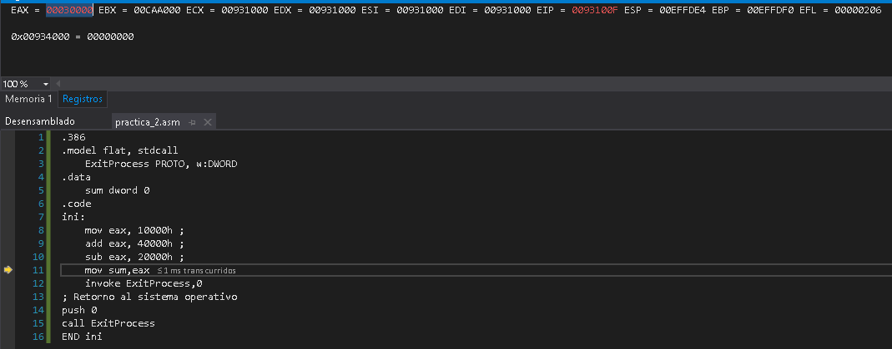
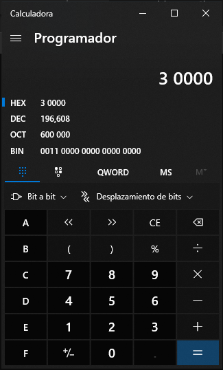
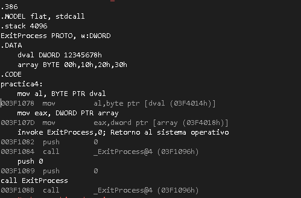

# Ejercicio 1

```asm
.386
.model flat,stdcall
.stack 4096
ExitProcess proto,dwExitCode:dword
.data
    sum dword 0
.code
main proc
    mov eax,5
    add eax,6
    mov sum,eax
    invoke ExitProcess,0
main endp
end main
```

Explique las modificaciones que debe realizar para que el programa coloque:

1. decimal
1. binary
1. hexadecimal

En el registro AX.

1. Ya esta en decimal
2. colocar los numeros en binario 5 => 101b, 6 => 110b

```bash
    mov eax,101b
    add eax,110b
```

3. Colocar h al final de los numeros 5 => 5h, 6 => 6h

```bash
    mov eax,5h
    add eax,6h
```

# Ejercicio 2

```asm
.386
.model flat, stdcall
    ExitProcess PROTO, w:DWORD
.data
    sum dword 0
.code
ini:
    mov eax, 10000h ;
    add eax, 40000h ;
    sub eax, 20000h ;
    mov sum,eax
    invoke ExitProcess,0
; Retorno al sistema operativo
push 0
call ExitProcess
END ini
```

¿Cuál es el valor que se le asigna a sum?
R/ **196 608**




# Ejercicio 3

```asm
.386
.MODEL flat, stdcall
.stack 4096
ExitProcess PROTO, w:DWORD
.DATA
    array1 WORD 30 DUP(?),0,0
    array2 WORD 5 DUP(3 DUP(?))
    array3 DWORD 1,2,3,4
    digitStr BYTE "12345678",0
.CODE
practica3:
    mov ecx, LENGTHOF array1;
    mov ecx, LENGTHOF array2;
    mov ecx, LENGTHOF array3;
    mov ecx, LENGTHOF digitStr;
    invoke ExitProcess,0; Retorno al sistema operativo
    push 0
call ExitProcess
END practica3
```

¿Cual es la longitud de los arreglos array1,array2,array3 y digitStr?

- **array1**: 32
- **array2**: 15
- **array3**: 4
- **digitStr**: 9

# Ejercicio 4

```bash
.386
.MODEL flat, stdcall
.stack 4096
ExitProcess PROTO, w:DWORD
.DATA
    dval DWORD 12345678h
    array BYTE 00h,10h,20h,30h
.CODE
main:
    mov al, dval
    mov eax, array
    invoke ExitProcess,0; Retorno al sistema operativo
    push 0
call ExitProcess
END main
```

R:/ El error esta en que se intenta asignar valores que ocupan mas bytes que el destido que se pretende para ellos

```bash
.386
.MODEL flat, stdcall
.stack 4096
ExitProcess PROTO, w:DWORD
.DATA
    dval DWORD 12345678h
    array BYTE 00h,10h,20h,30h
.CODE
practica4:
    mov al, BYTE PTR dval
    mov eax, DWORD PTR array
    invoke ExitProcess,0; Retorno al sistema operativo
    push 0
call ExitProcess
END practica4
```



# Ejercicio 5

```bash
.386
.model flat,stdcall,c
    includelib msvcrtd
    includelib oldnames
    includelib legacy_stdio_definitions.lib
.data
    mensaje db "Hola mundo!",0dh,0ah,0
.code
extrn printf:near
public main
main proc
    mov eax, offset mensaje
    push eax
    call printf
    pop eax ;
    ret
main endp
end
```

Modifique el código para mostrar un menú.

1. Agregar
2. Eliminar
3. Salir

**Solucion**

```bash
.386
.model flat,stdcall,c
 includelib msvcrtd
 includelib oldnames
 includelib legacy_stdio_definitions.lib
.data
mensaje db "BIENVENIDO AL MENU",0dh,0ah,
		 "1- Agregar",0dh,0ah,
		"2- Eliminar",0dh,0ah,
		"1- Salir",0dh,0ah,0
.code
 extrn printf:near

public main
practica5 proc
 mov eax, offset mensaje
 push eax
 call printf
 pop eax ;

 ret
practica5 endp
end
```

# Ejercicio 6

```bash
INCLUDE mip115.inc
.data
    etiqueta db "Bienvenidos a MiP115", 0
    holamensaje BYTE "Esta es una mensaje de bienvenida.", 0dh,0ah
                BYTE "Clic para continuar...", 0
.code
main PROC
    mov ebx,0
    mov edx,OFFSET holamensaje ; este mensaje no tiene etiqueta
    call MsgBox
    mov ebx,OFFSET etiqueta
    mov edx,OFFSET holamensaje
    call MsgBox
    exit
main ENDP
END main
```

# Ejercicio 7

```bash
INCLUDE mip115.inc
.data
    etiqueta BYTE "Encuesta",0
    pregunta BYTE "Gracias por completar la encuesta"
             BYTE 0dh,0ah
             BYTE "Legustaria recibir resultados?",0
    resultados BYTE "Se enviaran a su correo",0dh,0ah,0
.code
main PROC
    mov ebx,OFFSET etiqueta
    mov edx,OFFSET pregunta
    call MsgBoxAsk
    exit
main ENDP
END main
```
